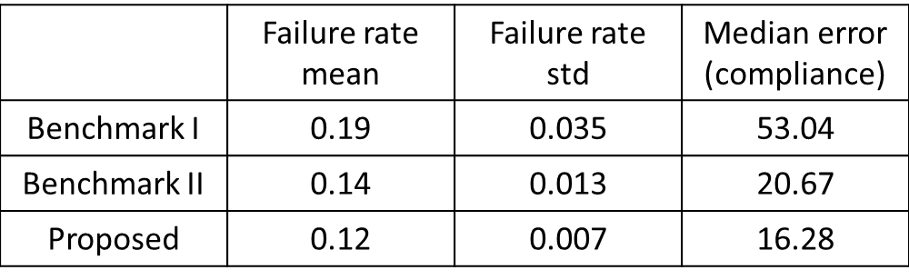

# One-Shot Optimal Topology Generation through Theory-Driven Machine Learning

## Abstract
We introduce a theory-driven mechanism for learning a neural network model that performs 
generative topology design in one shot given a problem setting, circumventing the conventional 
iterative procedure that computational design tasks usually entail. The proposed mechanism can 
lead to machines that quickly response to new design requirements based on its knowledge accumulated 
through past experiences of design generation. Achieving such a mechanism through supervised learning 
would require an impractically large amount of problem-solution pairs for training, due to the known 
limitation of deep neural networks in knowledge generalization. To this end, we introduce an 
interaction between a student (the neural network) and a teacher (the optimality conditions 
underlying topology optimization): The student learns from existing data and is tested on unseen 
problems. Deviation of the student's solutions from the optimality conditions is quantified, and 
used to choose new data points for the student to learn from. We show through a compliance minimization 
problem that the proposed learning mechanism is significantly more data efficient than using a static 
dataset under the same computational budget.

Full paper available [here](https://arxiv.org/abs/1807.10787).

## Result Summary
Two case studies on compliance minimization problems are demonstrated:

Sample solutions for (a) Case 1, where a point load is applied to the middle node at the tip of the cantilever beam, with directions uniformly distributed in [0,pi], and (b) Case 2, where the point load is applied to a node in the highlighted area which occupies one-third of the design space, with its direction drawn from [0,2pi]. Three different methods (include proposed method) are compared:
- Benchmark I: Use a static dataset for training.
- Benchmark II:Choose data points by measuring the difference between the compliance produced by the generator and the predicted compliance based on the training data.
- Proposed method: Similar to benchmark II, but evaluating the data points by measuring its violation to the physics based optimality condition.

### Result for case 1

Case 1 topologies predicted by (a) Benchmark I, (b) Benchmark II, (c) the proposed method. (d) Ground truth computed using the Augmented Lagrangian solver. Compliance values are shown at the bottom of each topology. Loading directions are marked as red arrows.

Numerical wise comparision:

### Result for case 2

To be noted, for this more complicated case, we add another penalty on the reconstruction loss to reduce the fail rate, which is the sensitivity information shown on the ground truth (last row): cold (warm) color indicates lower (higher) design sensitivity.

Numerical wise comparision:

