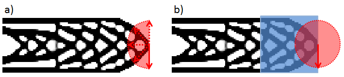
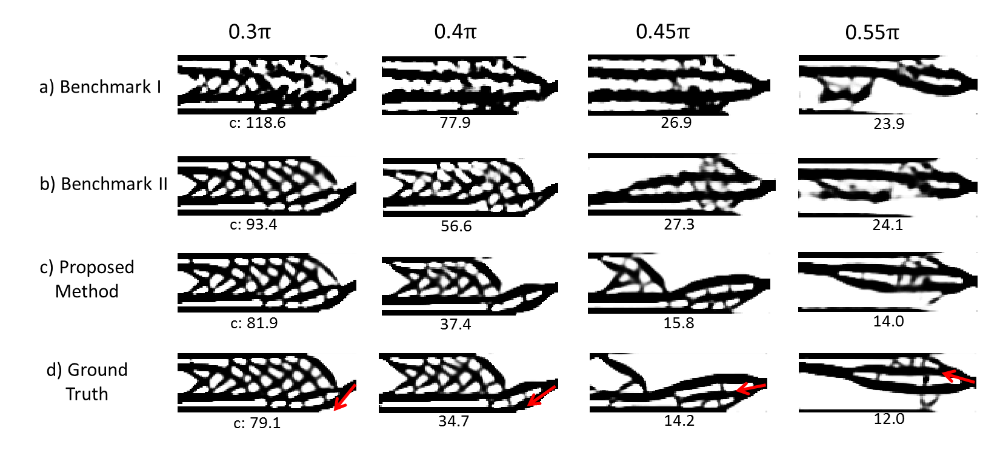
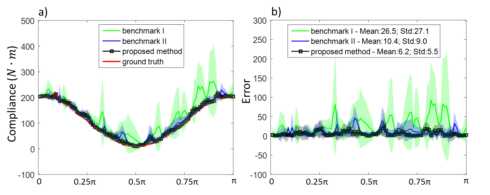
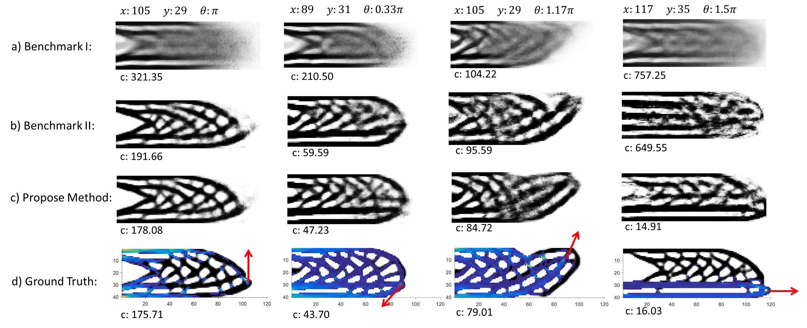

# One-Shot Optimal Topology Generation through Theory-Driven Machine Learning

## Abstract
We introduce a theory-driven mechanism for learning a neural network model that performs 
generative topology design in one shot given a problem setting, circumventing the conventional 
iterative procedure that computational design tasks usually entail. The proposed mechanism can 
lead to machines that quickly response to new design requirements based on its knowledge accumulated 
through past experiences of design generation. Achieving such a mechanism through supervised learning 
would require an impractically large amount of problem-solution pairs for training, due to the known 
limitation of deep neural networks in knowledge generalization. To this end, we introduce an 
interaction between a student (the neural network) and a teacher (the optimality conditions 
underlying topology optimization): The student learns from existing data and is tested on unseen 
problems. Deviation of the student's solutions from the optimality conditions is quantified, and 
used to choose new data points for the student to learn from. We show through a compliance minimization 
problem that the proposed learning mechanism is significantly more data efficient than using a static 
dataset under the same computational budget.

Full paper is available [here](https://arxiv.org/abs/1807.10787).

## Problem Statement
We define a one-shot solution generator as a feedforword neural network 
that computes a solution (e.g., a topology) given problem settings (e.g., loads).
 It is one-shot in the sense 
that computing solutions through the network is much less expensive than 
using an iterative algorithm. We define the generalization 
performance of the generator as the expected performance of its 
solutions over a distribution of problems. The performance is measured 
by the compliance of the predicted solutions to the problem settings. 
Specific to topology optimization, 
the compliance is defined as the optimality conditions.

## Solution
We propose an active learning algorithm where the acquisition function is 
the l2 norm of the Lagrangian gradient. For each iteration of learning, we verify
the learned network using a large set of inputs: For each input, we use the network to 
predict their corresponding solutions, and evaluate the goodness of the solutions through
the acquisition function. The worth input is then chosen, and its ground truth solution
computed through an iterative algorithm (augmented Lagrangian). This new data point is
added to the training set for another round of network refinement.

## Result Summary
Two case studies on compliance minimization problems are demonstrated:

Sample solutions for (a) Case 1, where a point load is applied to the middle 
node at the tip of the cantilever beam, with directions uniformly distributed 
in [0,pi], and (b) Case 2, where the point load is applied to a node in the 
highlighted area which occupies one-third of the design space, with its direction 
drawn from [0,2pi]. Three different methods (include proposed method) are compared:
- Benchmark I - Static learning: Use a static dataset for training.
- Benchmark II - Active learning: Choose data points by measuring the difference between 
the compliance produced by the generator and the predicted compliance based 
(through polynomial curve fitting) on the training data.
- Proposed method: Similar to benchmark II, but verifying the model
by measuring its violation to the physics-based optimality condition.

### Result for case 1

Case 1 topologies predicted by (a) Benchmark I, (b) Benchmark II, (c) 
the proposed method. (d) Ground truth computed using the Augmented Lagrangian 
solver. Compliance values are shown at the bottom of each topology. 
Loading directions are marked as red arrows.

Comparisons on absolute compliance and compliance error.

### Result for case 2

Case 2 optimal topologies predicted by (a) Benchmark I, (b) Benchmark II, 
and (c) the proposed method. (d) The ground truth topologies with design 
sensitivity information (see [paper](https://arxiv.org/abs/1807.10787) for details): 
cold (warm) color indicates lower (higher) 
design sensitivity. The point loads are marked as arrows with detailed 
input values reported at the top of the figure. The compliance values are 
shown at the bottom of each topology.

Comparisons on solution generation failure rate (failure = compliance gap > 1000) 
and the median compliance gap:

|              | Failure rate: mean(std) | Median compliance gap: mean(std) |
|--------------|-------------------------|----------------------------------|
| Benchmark I  | 5.12% (1.2%)            | 22.12 (3.34)                     |
| Benchmark II | 0.64% (0.42%)           | 6.64 (0.87)                      |
| Proposed     | 0.16% (0.09%)           | 5.2 (0.6)                        |

